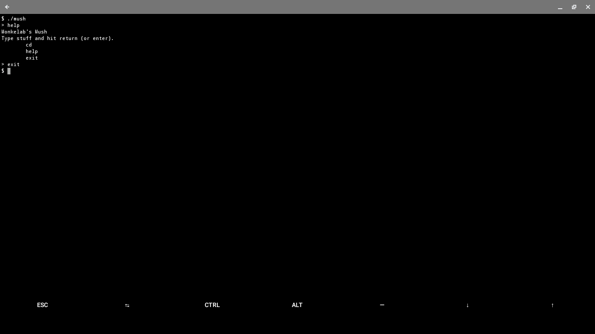

# mush

Monke Ultimate SHell  

The ultimate shell for monkes.

Features:

* [x] Executing commands  
* [x] Built-in commands  
    * [x] cd  
    * [x] help  
    * [x] exit  
* [ ] Language and interpreter  
* [ ] Support for script files  
* [ ] Support for config fles  
* [ ] History file with up arrow support  

(I'll try to add these missing features swiftly)

Sense mush is currently lacking, if you wish to use it, I recommend appending it to your .bashrc file or any other method that does not actually change your shell
but runs the mush executable.

## Screenshot

